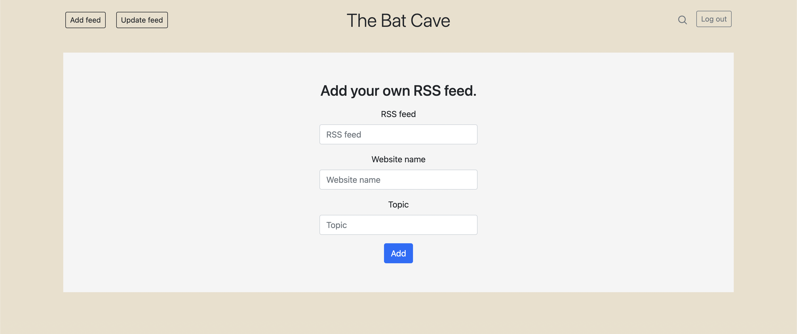
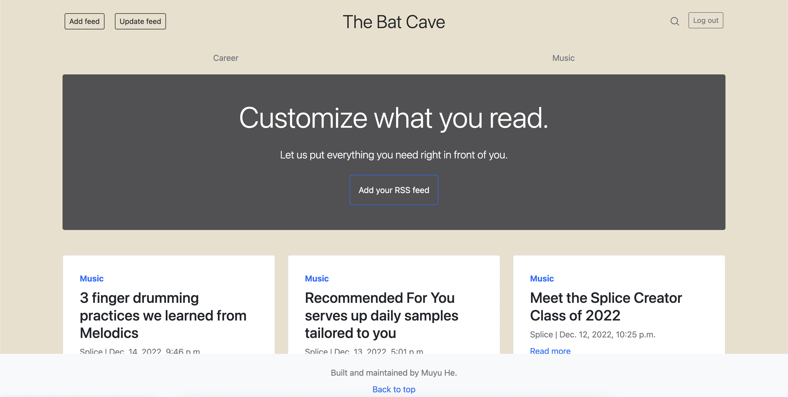

# Content Aggregator
A web app that automatically gets articles from users' favorite websites and updates them with just one click.
## Features
- Scrapes most recent articles directly from users' chosen websites and add them to feeds in the main page and to their respective topic pages.

    

- Automatically generates topics in the header section, the headline, and individual topic pages based on articles added to the app.

    

- Updates articles based on how recent they are on all pages with one click.

## Installment
To begin with, clone the project.
```
git clone https://github.com/RiddleHe/content_aggregator
```
After that, in the main directory, set up and activate a virtual environment to harbor the dependencies.
```
python3 -m venv ll_env
source ll_env/bin/activate
```
When the virtual environment is set up, install the dependencies.
```
pip install Django, feedparser, requests, django-bootstrap-v5
```
Then, in the main directory, run the server to load the web application, and now you can interact with it.
```
quiz % python3 manage.py runserver
```
## Technologies
*Using Python, Django, HTML, feedparser, requests, and Bootstrap*
- Built an input form that works with POST request data to activate feedparser and requests, parsing RSS feed from target website and accessing information of the website and individual articles.
- Used class composition techniques to add and update new articles in the database.
- Applied conditionals in HTML files to generate non-redundant links in the header section and individual topic pages.
